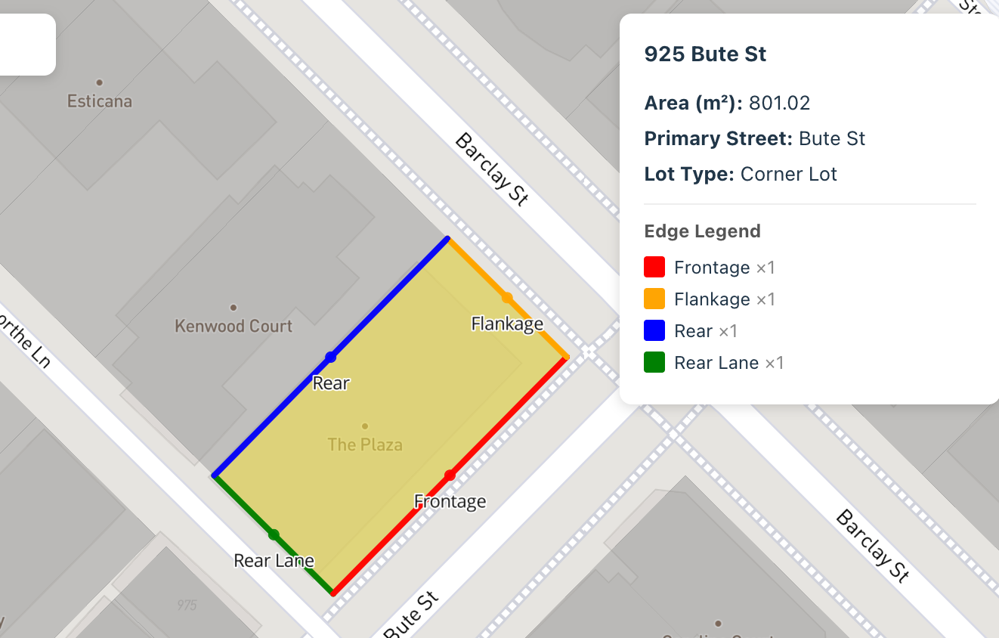
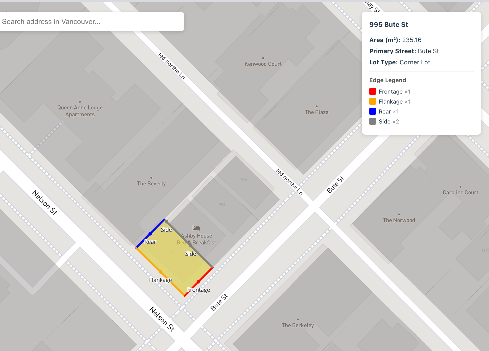
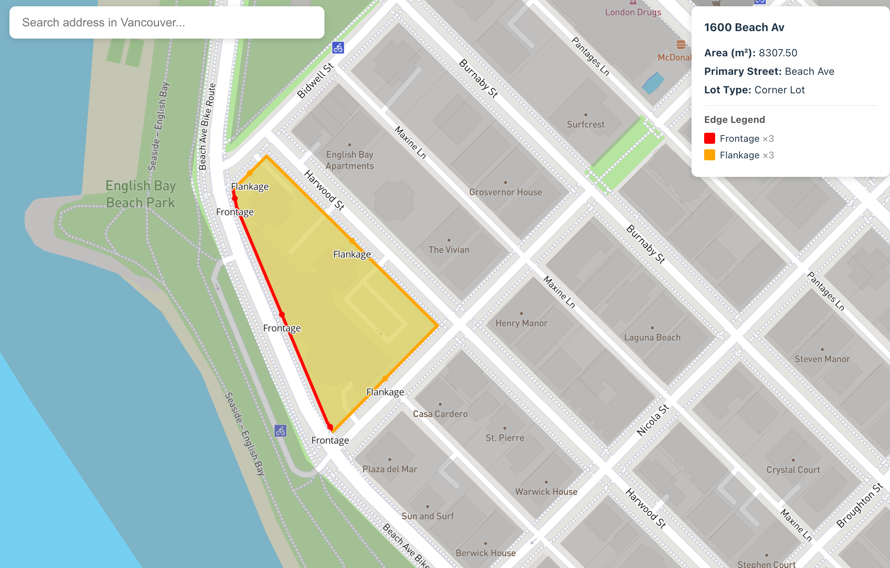
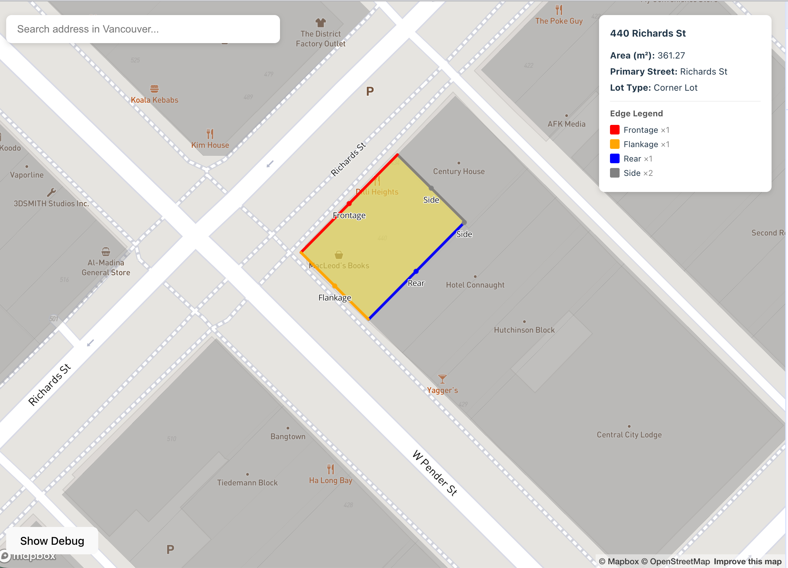
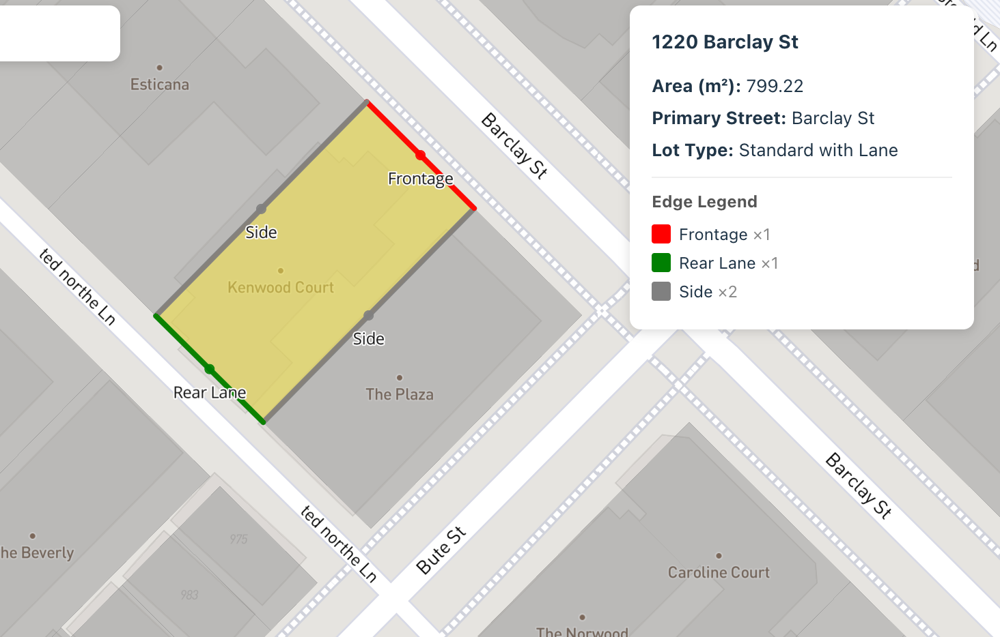
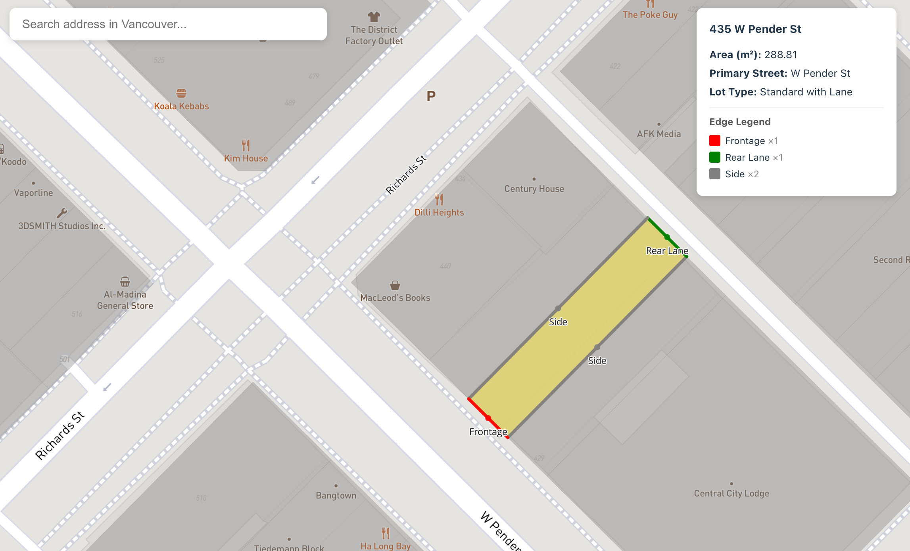
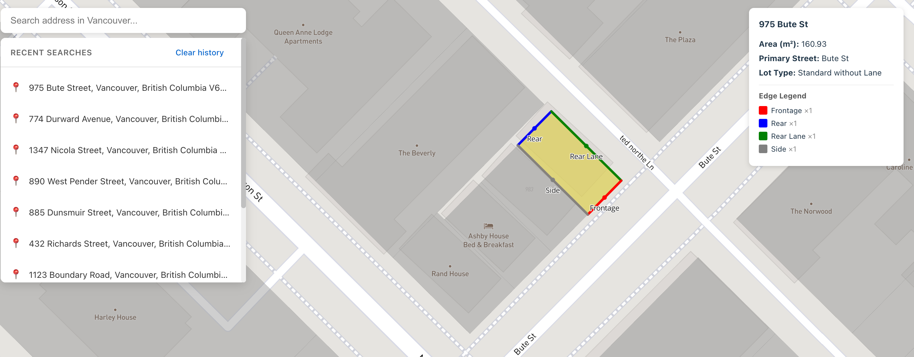
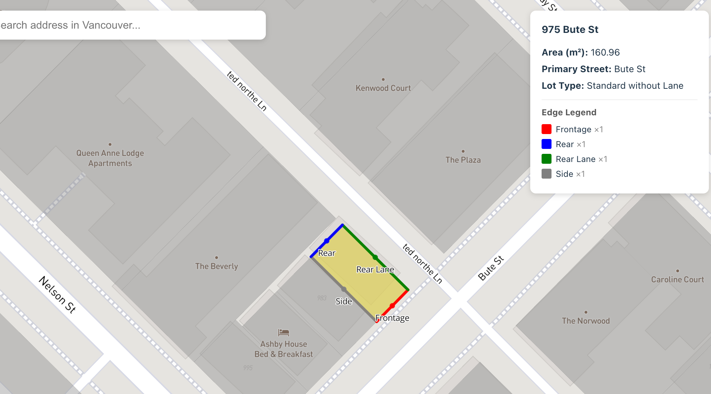
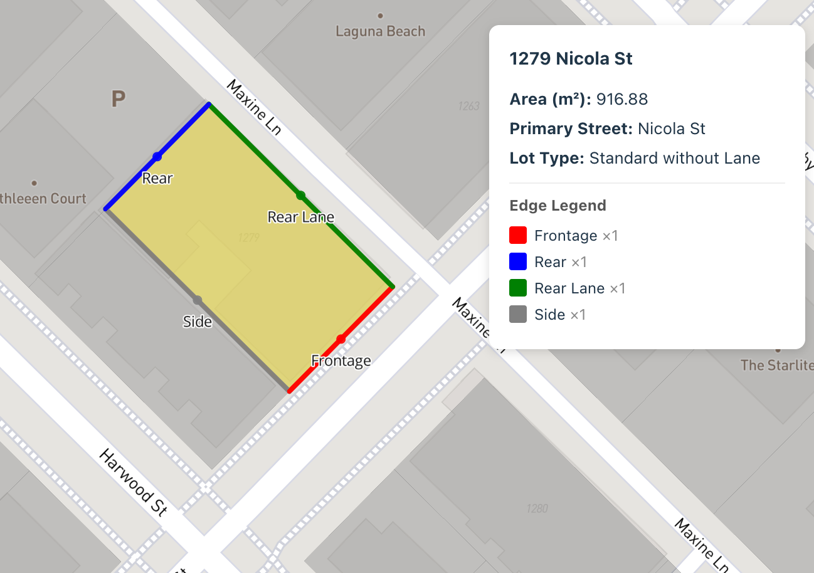

# Vancouver Parcel Lot Analysis Tool

> **Live Demo:** https://vancouver-parcel-lot-analysis-tool.vercel.app/

A React + TypeScript web app for parcel selection and edge-type classification in Vancouver.

### Corner Lot





### Standard with Lane



### Standard without Lane





## Functional Requirements Implemented

### 1. Map and Parcel Interaction
- Mapbox map centered on downtown Vancouver.
- Parcel polygons loaded from Vancouver Open Data (`property-parcel-polygons` GeoJSON API).
- Clicking a parcel highlights it and triggers edge analysis.

### 2. Address Search with Autocomplete
- Search bar with autocomplete suggestions (Mapbox Geocoding API).
- Search scope restricted to Vancouver via Canada filter and Vancouver bbox.
- Keyboard controls: `ArrowUp`, `ArrowDown`, `Enter`, `Escape`.
- Input debounce for API requests.
- Selecting a search result follows the same flow as map click:
  fly to location, select parcel, analyze edges, update info card.
- Search history shown when input is focused and empty.
- `Clear history` action available when history list is shown.

### 3. Parcel Info Card and Classification
- Info card appears after selection and shows:
  - Full Address
  - Area (m²)
  - Primary Street
  - Lot Type
- Edge visualization rendered on map (line color + labels).
- Edge types:
  - `Frontage`
  - `Flankage`
  - `Rear Lane`
  - `Rear`
  - `Side`

---

## Edge Classification Algorithm

Edge classification is implemented in [`src/utils/geoAnalysis.ts`](src/utils/geoAnalysis.ts).

### Edge Types

| Type | Definition |
|------|------------|
| **Frontage** | The edge(s) directly adjacent to the primary named street (the street in the parcel's civic address). Must be parallel to the street (≤55°) and within the frontage distance threshold. |
| **Flankage** | An edge directly adjacent to a **different** named street (not the frontage street), on the side of the lot. Applies to corner lots. Requires direct adjacency: edge midpoint within 14 m of the cross-street AND angle ≤42°. |
| **Rear Lane** | An edge directly adjacent to a lane/alley/service road. Must be **parallel** to the lane (≤30°), within 3 m (strict) or 6 m (fallback) of the edge midpoint, and on the **exterior** side of the parcel. |
| **Rear** | The edge on the opposite side of the parcel from the Frontage. Must **not** be directly adjacent to any named street or lane (midpoint distance > 14 m from any street). Must be roughly anti-parallel to the Frontage (cosine < −0.65). |
| **Side** | All remaining edges that do not qualify for any of the above types. |

### Classification Pipeline

```
1. Detect street adjacency for each edge
   - findAdjacentRoad (3-point min, 38 m radius) → streetAdjacency
   - findAdjacentRoadWithAngle (midpoint only, 38 m, ≤55°) → parallelStreetAdjacency
   - Primary street override: if primary street found within 35 m and more parallel, use it
   - Store streetMidpointDistance (midpoint-only re-measurement for Rear/Flankage checks)

2. Detect lane adjacency for each edge
   - findAdjacentRoadWithAngle (midpoint only, ≤3 m strict / ≤6 m fallback, ≤30°)
   - isLaneOnExteriorSide check: rejects lanes on the interior/opposite side of thin lots

3. Classify Frontage
   - Pick best candidate: highest primary-street match score, shortest midpoint distance
   - Expand along perimeter while adjacent edges share the same street name and are parallel (≤35°) to the seed

4. Classify Flankage
   - For each non-Frontage edge, run findAdjacentRoadWithAngle(14 m, 42°) against non-lane roads
   - Skip if the found road normalises to the same name as the frontage street
   - Skip if a lane is closer than the street by ≥4 m (lane dominates)
   - Group by normalised street name; pick closest edge as seed, expand along perimeter

5. Classify Rear Lane
   - For each non-Frontage, non-Flankage edge, check laneAdjacency
   - Group by lane road reference (named lanes grouped by name; unnamed lanes grouped by road object)
   - Pick closest edge as seed; expand along perimeter within 6 m of seed distance

6. Fill pass
   - A Side edge sandwiched between two Rear Lane edges on the perimeter is promoted to Rear Lane

7. Classify Rear
   - Search remaining Side edges that are anti-parallel to Frontage (cosine < −0.65)
   - Exclude edges whose midpoint is within 14 m of a named street
   - Three-tier fallback: prefer edges with no road/lane adjacency; then any adjacency
```

### Key Thresholds

| Constant | Value | Purpose |
|----------|-------|---------|
| `laneStrictThreshold` | 3 m | Preferred lane adjacency radius (midpoint) |
| `laneFallbackThreshold` | 6 m | Extended lane adjacency radius (midpoint) |
| `maxFlankageStreetDistance` | 14 m | Max midpoint distance for Flankage / Rear street adjacency |
| `maxFlankageStreetAngle` | 42° | Max angle between edge and cross-street for Flankage |
| `streetAdjacencyThreshold` | 38 m | General street search radius (3-point min) |
| `primaryStreetThreshold` | 70 m | Primary street search radius (midpoint) |
| `rearParallelCosineThreshold` | −0.65 | Min anti-parallel cosine for Rear candidate (≈49° from opposite) |

### Lot Type Classification

Implemented in [`src/utils/classification.ts`](src/utils/classification.ts):

| Lot Type | Condition |
|----------|-----------|
| **Corner Lot** | Has ≥1 Frontage edge AND ≥1 Flankage edge (on different named streets) |
| **Double Fronting** | Has Frontage edges on ≥2 different named streets, no Flankage |
| **Standard with Lane** | Has exactly 1 frontage street AND a Rear Lane edge that is **anti-parallel** to the Frontage (cosine < −0.65) |
| **Standard without Lane** | All other cases |

### Important Design Decisions

- **Midpoint-only distance for lane/flankage**: All lane and flankage adjacency checks use the edge **midpoint** (not start/end/midpoint minimum) to avoid false positives from shared parcel corners at road intersections.
- **Exterior-side check for lanes (`isLaneOnExteriorSide`)**: On thin lots both long edges can be within the lane distance threshold. This check uses the parcel centroid to verify the detected lane is on the outward-facing side of the edge.
- **Primary street override**: Ensures the frontage street is correctly associated even when the basemap road feature is slightly further than a nearby side street. Capped at 35 m and only overrides if the primary street is more parallel.
- **`edgeDirection` uses first-to-last coordinates**: For multi-node road LineStrings (long lanes with many waypoints) this gives the correct overall direction rather than just the first segment's direction.

### 4. Debug Mode
- Toggle button reveals developer diagnostics panel.
- Panel includes map state, selected parcel fields, lot type, edge list, and loaded road feature count.

## Data Sources

- Parcel data: Vancouver Open Data `property-parcel-polygons` (GeoJSON export API).
- Road context for classification: Mapbox Streets basemap rendered road layers (queried from map view).

## Tech Stack

- React 19
- TypeScript
- Vite
- Mapbox GL JS
- Turf.js
- Zustand
- ESLint

## Project Structure

- `src/components/MapView.tsx`: map setup, parcel loading, click/search selection flow.
- `src/components/SearchBar.tsx`: autocomplete UI, keyboard navigation, history.
- `src/components/InfoCard.tsx`: parcel summary card.
- `src/components/DebugPanel.tsx`: diagnostics UI.
- `src/utils/geoAnalysis.ts`: edge classification rules.
- `src/utils/geometry.ts`: geometry helpers and adjacency logic.
- `src/utils/__tests__/geometry.test.ts`: unit tests for geometry helpers.
- `src/utils/__tests__/classification.test.ts`: unit tests for lot classification.
- `src/utils/__tests__/geoAnalysis.test.ts`: integration tests for edge classification.
- `src/store.ts`: Zustand state.

## Setup

### Prerequisites
- Node.js 18+
- npm
- A Mapbox access token

### Install

```bash
npm install
```

### Environment Variables

Create `.env` in project root:

```bash
VITE_MAPBOX_TOKEN=your_mapbox_token_here
```

## Run

### Development

```bash
npm run dev
```

### Production Build

```bash
npm run build
```

### Preview Build

```bash
npm run preview
```

## Test and Validation

### Automated Tests

53 unit and integration tests covering geometry helpers, lot classification, and the full edge classification pipeline (Vitest):

```bash
npm test
```

Test coverage:
- `geometry.test.ts` — `edgeDirection`, `dotProduct`, `calculateAngleBetweenLines`, `extractEdges`
- `classification.test.ts` — all 4 lot types, priority ordering, edge cases
- `geoAnalysis.test.ts` — end-to-end scenarios: Standard lot, Standard with Lane, Corner Lot, MultiPolygon parcels, degenerate inputs

### Linting and Build

```bash
npm run lint
npm run build
```

### Recommended Manual Checks

- Click parcels at different blocks and verify edge labels and colors.
- Search for Vancouver addresses and verify selection flow.
- Confirm search history appears on empty-input focus and can be cleared.
- Toggle debug mode and verify diagnostics panel updates.
